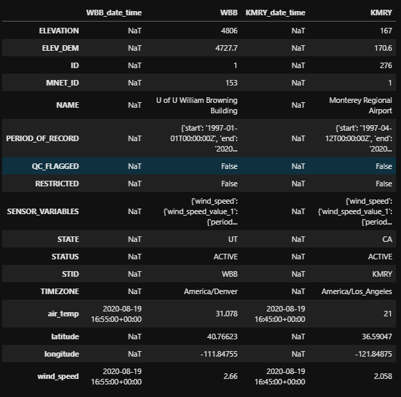

<div
    align='center'
>


# ☁ Synoptic API for Python (_unofficial_)

<!-- Badges -->
[](https://pypi.python.org/pypi/SynopticPy/)

[](https://zenodo.org/badge/latestdoi/288617886) 
[](https://github.com/psf/black)
<!--[](https://gitter.im/blaylockbk/SynopticPy?utm_source=badge&utm_medium=badge&utm_campaign=pr-badge&utm_content=badge)-->
</div>


The [Synoptic Mesonet API](https://synopticdata.com/mesonet-api) (formerly MesoWest) gives you access to real-time and historical surface-based weather and environmental observations for thousands of stations. 

# 📔 [SynopticPy Documentation](https://blaylockbk.github.io/SynopticPy/_build/html/)

Synoptic data access is [_free_](https://synopticdata.com/news/2022/3/15/synoptic-data-pbc-launches-new-open-access-weather-data-service) for open-access data. More data and enhances services are available through a [paid tier](https://synopticdata.com/pricing) (available through Synoptic, not me).


> ### 🌐 Register for a free account at the Synoptic API Webpage
>> https://developers.synopticdata.com
>
> You will need to obtain an API token before using this python package.

I wrote these functions to conveniently access data from the Synoptic API and convert the JSON data to a **[Pandas DataFrame](https://pandas.pydata.org/docs/)**. This may be helpful to others who are getting started with the Synoptic API and Python. The idea is loosely based on the obsolete [MesoPy](https://github.com/mesowx/MesoPy) python wrapper, but returning the data as a Pandas DataFrame instead of a simple dictionary, making the retrieved data more *ready-to-use*.

- [👨🏻‍🏭 Contributing Guidelines and Disclaimer](https://blaylockbk.github.io/SynopticPy/_build/html/user_guide/contribute.html)
- [💬 Discussions](https://github.com/blaylockbk/SynopticPy/discussions)
- [🐛 Issues](https://github.com/blaylockbk/SynopticPy/issues)

If you have stumbled across this package, I hope it is useful to you or at least gives you some ideas.

**Best of Luck 🍀**  
-Brian

---

<br><br><br>

# 🐍 Installation

## Option 1: conda (recommended)
If conda environments are new to you, I suggest you become familiar with [managing conda environments](https://docs.conda.io/projects/conda/en/latest/user-guide/tasks/manage-environments.html).

I have provided a sample Anaconda [environment.yml](https://github.com/blaylockbk/SynopticPy/blob/main/environment.yml) file that lists the minimum packages required plus some extras that might be useful when working with other types of weather data. Look at the bottom lines of that yaml file...there are two ways to install SynopticPy with pip. Comment out the line you don't want.

```yaml
- pip:
    - git+https://github.com/blaylockbk/SynopticPy.git  # for latest updates
    #- SynopticPy  # for latest release
```

First, create the virtual environment with 

```bash
wget https://raw.githubusercontent.com/blaylockbk/SynopticPy/main/environment.yml
conda env create -f environment.yml
```

Then, activate the `synoptic` environment. Don't confuse this _environment_ name with the _package_ name.

```bash
conda activate synoptic
```

Occasionally, you might want to update all the packages in the environment.

```bash
conda env update -f environment.yml
```

## Option 2: pip
Install the last published version from PyPI. This requires the following are already installed:  
`numpy`, `pandas`, `requests`, and `toml`. It's optional, but you will likely want `matplotlib`, and `cartopy`, too.

```bash
pip install SynopticPy
```

# 🔨 Setup
After following the setup instructions in the [documentation](https://blaylockbk.github.io/SynopticPy/_build/html/user_guide/setup.html), you should have a file at `~/.config/SynopticPy/config.toml` that looks something like this:

```
[default]
verbose = true
hide_token = true
rename_value_1 = true
rename_set_1 = true
token = "1234567890abcdefghijklmnopqrstuvwxyz"
```

If you don't do this step, don't worry. When you import `synoptic.services`,
a quick check will make sure the token in the config file is valid. If not,
you will be prompted to update the token in the config file.

# Quick Examples

- [User Guide Examples](https://blaylockbk.github.io/SynopticPy/_build/html/user_guide/examples.html)
- [Reference Guide](https://blaylockbk.github.io/SynopticPy/_build/html/reference_guide/index.html)
- [Jupyter Notebooks](https://github.com/blaylockbk/SynopticPy/tree/main/notebooks)

> TODO: Move these notebooks to the docs.

```python
# Import all functions
import synoptic.services as ss
```
or

```python
# Import a single function (prefered)
from synoptic.services import stations_timeseries
```

Get a timeseries of air temperature and wind speed at the station WBB for the last 10 hours:

```python
from datetime import timedelta
from synoptic.services import stations_timeseries

df = stations_timeseries(
    stid='WBB', 
    vars=['air_temp', 'wind_speed'],
    recent=timedelta(hours=10)
)
```


Get the latest air temperature and wind speed data for WBB (University of Utah) and KRMY (Monterey, CA airport) within one hour (with `windin` given as an interger in minutes, this may also be a timedelta object instead).

```python
from synoptic.services import stations_latest

df = stations_latest(
    stid=['WBB', 'KMRY'],
    vars=['air_temp', 'wind_speed'],
    within=60
)
```


Get the air temperature and wind speed for WBB and KMRY nearest 00:00 UTC Jan 1, 2020 within one hour...

```python
from datetime import datetime
from synoptic.services import stations_nearesttime

df = stations_latest(
    stid=['WBB', 'KMRY'], 
    vars=['air_temp', 'wind_speed'],
    attime=datetime(2020,1,1),
    within=60
)
```


