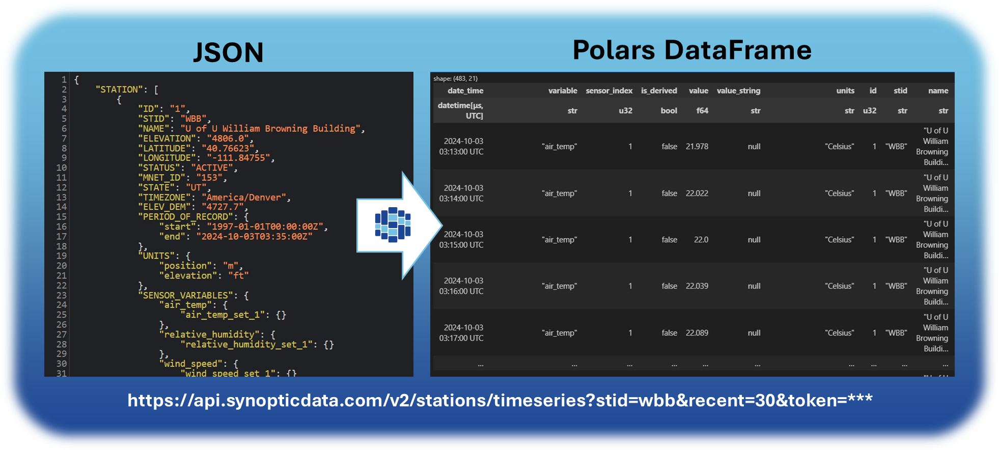

<div
    align='center'
>

<picture>
  <source media="(prefers-color-scheme: dark)" srcset="https://raw.githubusercontent.com/blaylockbk/SynopticPy/refs/heads/56-rewrite-using-polars/docs/_static/SynopticPy_white.svg">
  <source media="(prefers-color-scheme: light)" srcset="https://raw.githubusercontent.com/blaylockbk/SynopticPy/refs/heads/56-rewrite-using-polars/docs/_static/SynopticPy_blue.svg">
  
</picture>

## Synoptic API for Python

<!-- Badges -->

[](https://pypi.python.org/pypi/SynopticPy/)
[](https://anaconda.org/conda-forge/synopticpy)
[](https://zenodo.org/badge/latestdoi/288617886)


[](https://github.com/astral-sh/ruff)
[](https://github.com/blaylockbk/SynopticPy/actions/workflows/tests-python.yml)
[](https://synopticpy.readthedocs.io/?badge=latest)
[](https://pypi.org/project/SynopticPy/)
[](https://anaconda.org/conda-forge/synopticpy)
[](https://anaconda.org/conda-forge/synopticpy)

<!-- (Badges) -->

## 📘 [Documentation](https://synopticpy.readthedocs.io/) | [💬 Discussions](https://github.com/blaylockbk/SynopticPy/discussions) | [🚑 Issues](https://github.com/blaylockbk/SynopticPy/issues)

</div>

[Synoptic's Weather API](https://synopticdata.com/weatherapi/) provides real-time and historical surface-based weather and environmental observations for thousands of mesonet stations, and the [open-access data](https://synopticdata.com/pricing/open-access-pricing/) is _free_. More data and enhanced services may be purchased (from Synoptic, not me).

I'm a Synoptic user. I wrote this package to conveniently request data from Synoptic in a Pythonic way and convert its returned JSON to a **[Polars DataFrame](https://docs.pola.rs/user-guide/getting-started/)**.

```python
from datetime import timedelta
from synoptic import TimeSeries

df = TimeSeries(
    stid="wbb",
    recent=timedelta(minutes=30)
).df()
```



I'm sharing this package to improve my skills with Polars and gain more experience in building and maintaining open-source Python packages. If you came across this package, I hope you find it valuable.

**Best of Luck 🍀**  
-Brian

# 🐍 Install

```bash
pip install SynopticPy
```

```bash
conda install -c conda-forge synopticpy
```

## Configure Token

> [!IMPORTANT]
>
> ## 🎟️ You need a Synoptic API token before using SynopticPy. [Register for a FREE Synoptic account now](https://customer.synopticdata.com/).

There are three ways you can configure your Synoptic API token:

1. Set an environment variable `SYNOPTIC_TOKEN` with your token. For example, in bash:
   ```bash
   export SYNOPTIC_TOKEN="yourTokenHere123456789"
   ```
1. Create a file `~/.config/SynopticPy/config.toml` with the following
   ```toml
   token = "yourTokenHere123456789"
   ```
1. Pass your token whenever you use one of SynopticPy's classes.
   ```python
   TimeSeries(
       stid="wbb",
       recent=30,
       token="yourTokenHere123456789"
   )
   ```

# How to Cite and Acknowledge

If SynopticPy played an important role in your work, please [tell me about it](https://github.com/blaylockbk/SynopticPY/discussions/categories/show-and-tell)! Also, consider including a citation or acknowledgement in your article or product.

**_Suggested Citation_**

> Blaylock, B. K. (YEAR). SynopticPy: Synoptic API for Python (Version 20??.?.?) [Computer software]. https://github.com/blaylockbk/SynopticPy

**_Suggested Acknowledgment_**

> A portion of this work used code generously provided by Brian Blaylock's SynopticPy Python package (https://github.com/blaylockbk/SynopticPy)

<br>
<hr>

> [!TIP]
>
> ### 📈 See also my [SynopticPy Web App](https://blaylockbk.github.io/SynopticPy) which lets you plot station data in your browser powered by [pyscript](https://pyscript.net/)!
