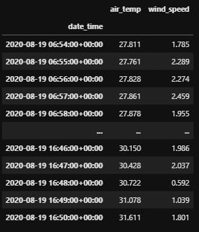
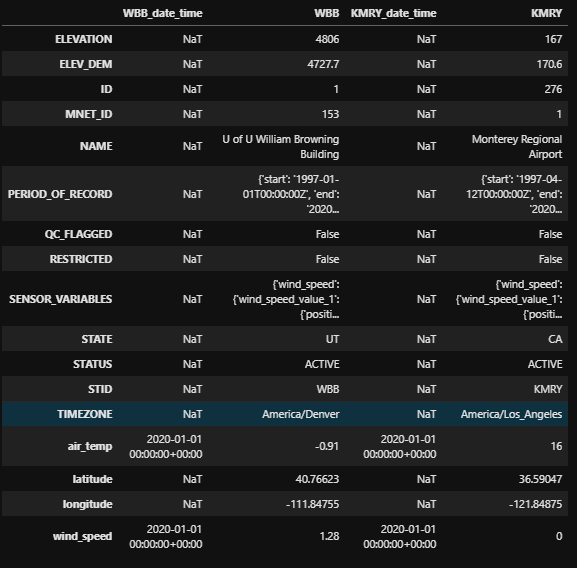

**Brian Blaylock**  
🌐 [Webpage](http://home.chpc.utah.edu/~u0553130/Brian_Blaylock/home.html)

# ☁ Synoptic API for Python (_unofficial_)


The [Synoptic Mesonet API](https://synopticdata.com/mesonet-api) (formerly MesoWest) gives you access to real-time and historical surface-based weather observations for thousands of stations.

I wrote these functions to conveniently access data from the Synoptic API  and convert the JSON data to a **[Pandas DataFrame](https://pandas.pydata.org/docs/)**. Maybe this will be helpful to others who are getting started with the Synoptic API and Python. The idea is loosely based on the obsolete [MesoPy](https://github.com/mesowx/MesoPy) python wrapper, but returning the data as a Pandas DataFrame instead of a simple dictionary makes the retrieved data more *ready-to-use*.

|🌐 Synoptic API Webpage|
|--
|https://developers.synopticdata.com


---

## 🐍 Conda Environment
I have provided an `environment.yml` file that lists the minimum packages required (plus some extras that might be useful if you are working with weather data that might be useful in this environment).

If you have Anaconda installed, create this environment with 

    conda env create -f environment.yml
    
Then activate the `synoptic` environment with

    conda activate synoptic
    
If conda environments are new to you, I suggest you become familiar with [managing conda environments](https://docs.conda.io/projects/conda/en/latest/user-guide/tasks/manage-environments.html).


## 🔨 Setup
1. Clone this repository.
    ```bash
    git clone https://github.com/blaylockbk/Synoptic_API.git
    ```

1. Add the path to the `Synoptic_API/` directory to your **PYTHONPATH**, or include the following lines in your python script.
    ```python
    import sys
    sys.path.append('path/to/Synoptic_API/')
    ```
1. Edit `synoptic/mytoken.py` with your personal API token. Before you can retrieve data from the Synoptic API, **you need to register as a Synoptic user and create a "token."** Follow the instructions at the [Getting Started Page](https://developers.synopticdata.com/mesonet/v2/getting-started/). When you edit `mytoken.py`, it should look something like this:
    ```python
    token = '1234567890qwertyuiop'
    ```

## 📝 Jupyter Notebook Examples

The [notebooks directory](https://github.com/blaylockbk/Synoptic_API/tree/master/notebooks) contains some practical examples of using these functions to get and show data.

## 🎟 `synoptic/mytoken.py`
Edit this file with your own Synoptic API token. You must do this before making and API request.

## 👨🏻‍💻 `synoptic/services.py`
Functions for making API requests, returned as Pandas DataFrames.

```python
# Import all functions
import synoptic.services as ss
```
or
```python
# Import a single function
from synotpic.services import stations_timeseries
```

### Available Functions
There is a separate function for each of the Synoptic Mesonet API services.

1. `synoptic_api` - A generalized wrapper for making an API request and returns a `requests` object. You *could* access the raw JSON from this object, but the other functions will convert that JSON to a Pandas DataFrame. Generally, you won't use this function directly. The primary role of this function is to format parameter arguments to a string the API URL expects 
    - convert datetimes to strings
    - converts timedeltas to strings
    - converts lists of station IDs and variable names to comma separated strings.
1. `stations_metadata` - Returns metadata (information) about stations. [Docs 🔗](https://developers.synopticdata.com/mesonet/v2/stations/metadata/)
1. `stations_timeseries` - Return data for a period of time [Docs 🔗](https://developers.synopticdata.com/mesonet/v2/stations/timeseries/)
1. `stations_nearesttime` - Return observation closest to the requested time [Docs 🔗](https://developers.synopticdata.com/mesonet/v2/stations/nearesttime/)
1. `stations_latest` - Return the most recent observations [Docs 🔗](https://developers.synopticdata.com/mesonet/v2/stations/latest/)
1. 🏗 `stations_precipitation` - Return precipitation data (with derived quantities) [Docs 🔗](https://developers.synopticdata.com/mesonet/v2/stations/precipitation/) 
1. 🏗 `stations_latency` - Latency information for a station [Docs 🔗](https://developers.synopticdata.com/mesonet/v2/stations/latency/)
1. 🏗 `stations_qcsegments` - Quality control for a period [Docs 🔗](https://developers.synopticdata.com/mesonet/v2/stations/qcsegments/)
1. `networks` - Return information about networks of stations [Docs 🔗](https://developers.synopticdata.com/mesonet/v2/networks/)
1. `networktypes` - Return network category information [Docs 🔗](https://developers.synopticdata.com/mesonet/v2/stations/information/)
1. `variables` - Return available variables [Docs 🔗](https://developers.synopticdata.com/mesonet/v2/stations/variables/)
1. `qctypes` - Return quality control information [Docs 🔗](https://developers.synopticdata.com/mesonet/v2/stations/qctypes/)`
1. `auth` - Manage tokens (you are better off doing this in the browser in your [Synoptic profile](https://developers.synopticdata.com/settings/)) [Docs 🔗](https://developers.synopticdata.com/mesonet/v2/stations/auth/)

## 🧭 Function Parameters
Function arguments are stitched together to create a web query. The parameters you can use to filter the data depend on the API service. Synoptic's [API Explorer](https://developers.synopticdata.com/mesonet/explorer/) can help you determine what parameters can be used for each service.

If this is new to you, I recommend you become familiar with the [Station Selector arguments](https://developers.synopticdata.com/mesonet/v2/station-selectors/) first. These include keying in on specific stations or a set of stations within an area of interest(`stid`, `radius`, `vars`, `state`, etc.).

### How these functions work:
All lists are joined together into a comma separated string. For instance, if you are requesting three stations, you could do `stid=['WBB', 'KSLC', 'KMRY']`, and that will be converted to a comma separated list `stid='WBB,KSLC,KMRY'` required for the API request URL. Also, any input that is a datetime object (any datetime that can be parsed with f-string, `f'{DATE:%Y%m%d%H%M}'`) will be converted to a string required by the API (e.g., `start=datetime(2020,1,1)` will be converted to `start='YYYYmmddHHMM'` when the query is made.) The API requires `within` and `recent` arguments to be minutes as a integer. You may give integers for those arguments, but converting time to minutes is done automatically if you input a datetime.timedelta or a pandas datetime. For example `within=timedelta(minutes=30)` and `recent=pd.to_timedelta('1d')`.

For example, to get a time series of a the station WBB for just air temperature and wind speed for the last 10 hours (600 minutes)...

```python
from datetime import timedelta
from synotpic.services import stations_timeseries
a = stations_timeseries(stid='WBB', vars=['air_temp', 'wind_speed'], recent=timedelta(hours=10))
```


To get the latest air temperature and wind speed data for WBB and KRMY within one hour, we can also set the minutes as an integer...
```python
from synotpic.services import stations_latest
a = stations_latest(stid=['WBB', 'KMRY'], vars=['air_temp', 'wind_speed'], within=60)
```


> Note: `stations_latest(stid='WBB,KMRY', vars='air_temp,wind_speed', within=60)` is equivalent to the above example.

To get the air temperature and wind speed for WBB and KMRY nearest 00:00 UTC Jan 1, 2020 within one hour...

```python
from datetime import datetime
from synotpic.services import stations_nearesttime
a = stations_latest(stid=['WBB', 'KMRY'], 
                    vars=['air_temp', 'wind_speed'],
                    attime=datetime(2020,1,1),
                    within=60)
```


> Note: `stations_nearesttime(stid='WBB,KMRY', vars='air_temp,wind_speed', attime='2020010100', within=60)` is equivalent to the above example.


## ♻ Returned Data: Variable Names
The raw data retrieved from the Synoptic API is converted from JSON to a Pandas DataFrame. 

If you look at the raw JSON returned, you will see that the observation values are returned as "sets" and "values", (e.g., `air_temp_set_1`, `pressure_set_1d`, etc.). This is because some stations have more than one sensor for a variable (wind at more than one level) or is reported at more than one interval (ozone at 1 hr and 15 min intervals). Time series requests return "sets" and nearest time requests return "values".

I don't really like dealing with the set labels. Almost always, I want the **set** or **value** with the most data or the most recent observation. My functions, by default, will strip the `set_1` and `value_1` from the labels on the returned data. If there are more than one set or value, then the "set" and "value" labels will be retained for those extra sets.

- If a query returns `air_temp_set_1` and `air_temp_set_2`, then the labels are renamed `air_temp` and `air_temp_set_2`.
- If a query returns `pressure_set_1` and `pressure_set_1d`, then the labels are renamed `pressure_set_1` and `pressure` _if **set_1d** has more observations than **set_1**_.
- If a query returns `dew_point_temperature_value_1` at 00:00 UTC and `dew_point_temperature_value_1d` at 00:15 UTC are both returned, then the labels are renamed `dew_point_temperature_value_1` and `dew_point_temperature` because the derived quantity is the most recent observation available.

In short, all sets and values are always returned, but column labels are simplified for the columns that I am most likely looking to use. 

For the renamed columns, it is up to the user to know if the data is a derived quantity and which set/value it is. To find out, look for attributes "SENSOR_VARIABLES" and "RENAME" in the DataFrame attributes, or look at the raw JSON.

This makes sense to me, but if you are confused and don't trust what I'm doing, you can turn this "relabeling" off with `rename_set_1=False` and `rename_value_1=False` (for the appropriate function).

### Latitude and Longitude
Note that `LATITUDE` and `LONGITUDE` in the raw JSON is renamed to `latitude` and `longitude` (lowercase) to match [CF convention](http://cfconventions.org/).


### U and V Wind Components
If the returned data contains variables for both `wind_speed` and `wind_direction`, then the DataFrame will compute and return the `wind_u` and `wind_v` components.

## ✅ How to use the Quality Control Checks
By default, only basic QC range checks are applied to the data before it is returned by the API. These basic checks remove physically implausible data like removing a 300 degree temperature instead of returning the value. 

You can add additional QC checks that more stringently remove "bad" data that might not be representative of the area or caused by a faulty sensor. However, you can't expect every bad observation will be removed (or every good observation will be retained).

- [Read about the QC checks](https://developers.synopticdata.com/about/qc/)
- [Read the QC section for a stations service (e.g., timeseries)](https://developers.synopticdata.com/mesonet/v2/stations/timeseries/)

Some tips:

- You can turn on more QC checks by Synoptic with the parameter `qc_checks='synopticlabs'`
- You can turn all QC checks on (includes synopiclab, mesowest, and madis checks) with the parameter `qc_checks='all'`.
- You can see the number of data point removed in the QC summary in the DataFrame attributes `df.attrs['QC_SUMMARY']`.
- Specific checks can be turned on (read the docs for more details).

For example:

```python
stations_timeseries(stid='UKBKB', recent=60, qc_checks='synopticlabs')
```
or
```python
stations_timeseries(stid='UKBKB', recent=60, qc_checks='all')
```

## 📈 `synoptic/plots.py`
These are some helpers for plotting data from the Synoptic API. ***These are a work in progress***.

```python
# Import all functions
import synoptic.plots as sp
```
or
```python
# Import individual functions
from synoptic.plots import plot_timeseries
```

---

**Best of Luck 🍀**  
-Brian