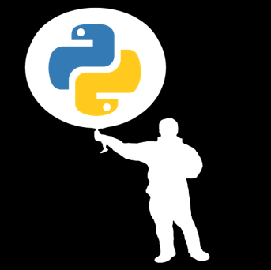

.. SynopticPy Docs documentation master file, created by
   sphinx-quickstart on Thu Dec 31 15:33:54 2020.
   You can adapt this file completely to your liking, but it should at least
   contain the root `toctree` directive.

===========================================
☁ The Synoptic API for Python (unofficial)
===========================================

API Reference
-------------

.. toctree::
   :maxdepth: 3
   :hidden:

   /reference_guide
   /contribute

The `Synoptic Mesonet API <https://synopticdata.com/mesonet-api>`_ (formerly MesoWest) gives you access to real-time and historical surface-based weather and environmental observations for thousands of stations. Synoptic is free up to 5,000 API requests and 5 million service units each month. That's a generous amount, but if you need even more data, a paid tier is available (through Synoptic, not me).

.. note::
   🌐 Register for a free account at the `Synoptic API Webpage
   <https://developers.synopticdata.com>`_. You will need to obtain an API token before using this python package.

I wrote these functions to conveniently access data from the Synoptic API and convert the JSON data to a `Pandas DataFrame <https://pandas.pydata.org/docs/>`_. This may be helpful to others who are getting started with the Synoptic API and Python. The idea is loosely based on the obsolete `MesoPy <https://github.com/mesowx/MesoPy>`_ python wrapper, but returning the data as a Pandas DataFrame instead of a simple dictionary, making the retrieved data more ready-to-use.

Contributing Guidelines
-----------------------
Since this package is a work in progress, it is distributed "as is." I do not make any guarantee it will work for you out of the box. In fact, this is my first experience publishing a package to PyPI. Any revisions I make are purely for my benefit. Sorry if I break something, but I usually only push updates to GitHub if the code is in a reasonably functional state (at least, in the way I use it).

With that said, I am happy to share this project with you. You are welcome to open issues and submit pull requests, but know that I may or may not get around to doing anything about it. If this is helpful to you in any way, I'm glad.

🐍 Install
-----------
Option 1

.. note::
   **This is a work in progress.** I'm doing SynopticPy with the PyData theme
   and HRRR-B with the ReadTheDocs theme.

.. include:: ../README.md