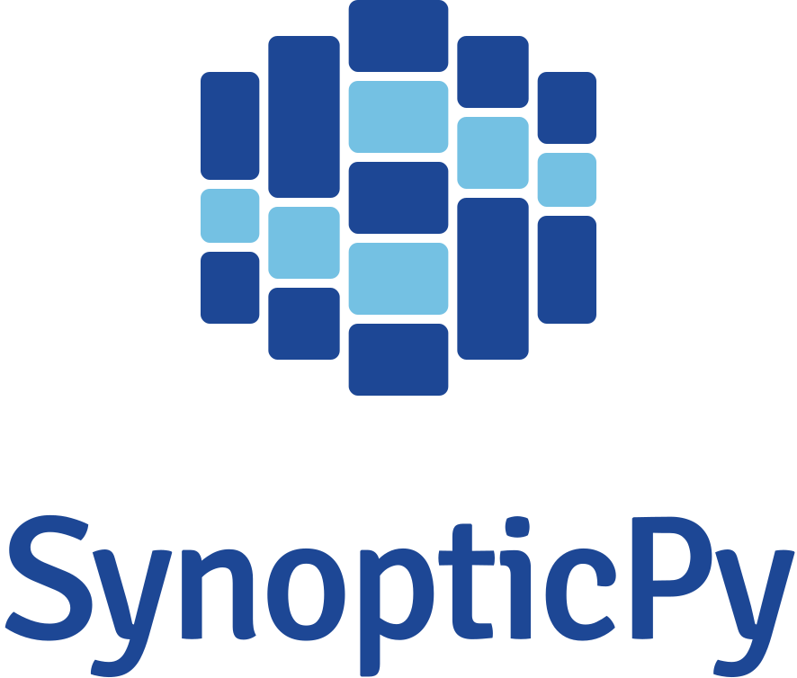
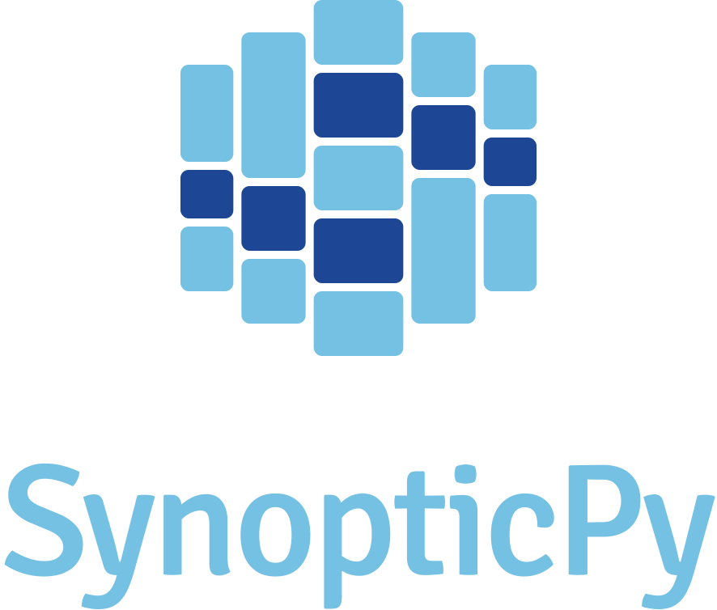
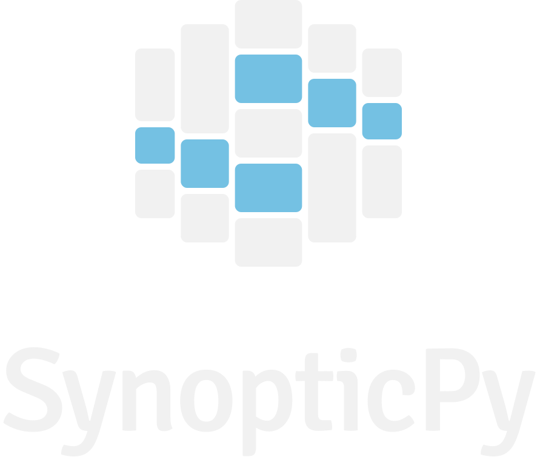
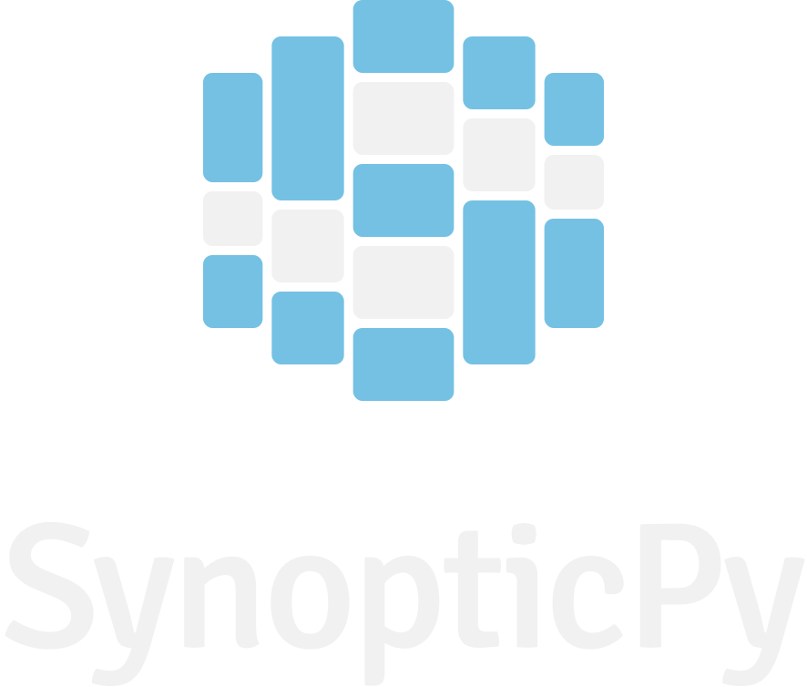

# 🎨 Style Guide

The SynopticPy logo and colors are inspired by a blend between Synoptic and Polars. The columns represent a DataFrame and make an "S" shape.

Thanks to [Nathan Blaylock](https://nathanblaylock.com/) for improving the logo design!

## Font: [Signika](https://fonts.google.com/specimen/Signika)

## Colors

### Blue : #1D4795

### Light Blue : #74C1E3

### White: #ffffff

## Samples

 
 

 
 

 
 

 
 

 
 

 
 

 
 

